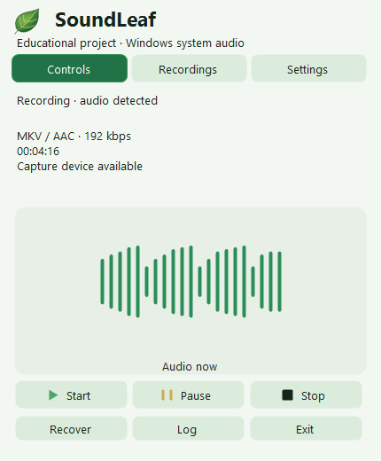

<p align="center"></p>

# SoundLeaf

[Deutsch](docs/README.de.md) · [Русский](docs/README.ru.md) · English

**Strictly an educational project · Windows 11 · x64 · Preview 3.0.5**

SoundLeaf is a C# learning project exploring Windows system audio, background processing, durable file storage and a system-tray interface. It is not a professional recording solution.

## Setup preview

The local `SoundLeaf-3.0.4-Setup-online.exe` candidate installs for the current user under `%LOCALAPPDATA%\Programs\SoundLeaf` without administrator rights. It offers a pinned FFmpeg 9.0.1 download with SHA-256 verification. Setup does not start recording or enable startup. Launch SoundLeaf from Start later: recording begins after successful checks. [Setup and removal](docs/SETUP.md). No download is published yet.

## Features

- Capture the default Windows output device through WASAPI loopback; microphone capture is not implemented.
- Start, pause, resume and stop from the tray. Interface, notifications and documentation support German, Russian and English; language changes apply immediately.
- Green play: recording. Yellow bars: paused. Black square: stopped. A thicker rotating ring around a fixed, centered green triangle: saving. Red: failure or unfinished previous sessions while stopped.
- Durable WAV backup with live AAC encoding and one verified final MKV per session.
- Saving stages and an explicit final-file path; open the last verified output from the menu.
- Detect unfinished sessions and rebuild them from finalized or partial WAV parts. Originals are archived only after full verification.
- User-level startup option without administrator rights.
- Background checks before capture: durable folder write/rename, free space, and a short selected-profile encode/decode with a three-second limit per FFmpeg process.
- Explicit WAV-only recording when FFmpeg is unavailable; verified WAV parts and an atomic completion marker prevent deliberate WAV results being mistaken for crashes.

Recording starts automatically when SoundLeaf is launched only after its checks pass. Below 256 MiB free, capture is blocked. From 256 MiB to 1 GiB, or when space cannot be measured, the menu warns; these initial checks cannot guarantee enough space for the entire session. An FFmpeg failure offers “Начать запись только в WAV” but never switches modes automatically. Only capture audio you are entitled to record, with any required participant consent. Silence is normal and is not treated as a fault.

## Profiles, panel and recording library

The default remains **MKV / AAC 192 kbit/s**, with the source sample rate and channels. In Settings, choose one output format: MKV/AAC, OGG/Opus (initially 24 kbit/s, mono), MP3, M4A/AAC or AAC/ADTS. Opus uses 48 kHz, speech-oriented VBR and a target bitrate; file size is not guaranteed. MP3 uses CBR. Additional AAC/MP3 profiles use 48 kHz and retain mono/stereo; multichannel input is downmixed to stereo. Backup WAV retains original PCM.

Opus bitrates: 16/24/32/48/64/96/128. AAC and MP3: 64/96/128/160/192/256/320 kbit/s. Each format remembers its bitrate. Format and save folder can change only while stopped; a session keeps its immutable profile. Language and the light/dark/system theme change immediately, including during recording.

Left click toggles a compact leaf-themed panel: Controls, Recordings and Settings. Right click opens the fallback menu. Escape or clicking outside hides the panel, not the recording. There is no main window or taskbar button.

The panel appears immediately above the actual tray icon and hides immediately. Snapshot-based opening/closing was removed to avoid stutter and the late appearance of a native shadow. Its usual size is 430 × 520 logical pixels; it stays inside the monitor's work area with per-monitor DPI scaling. A missing icon rectangle uses the saved click position. Settings use compact rows, a one-line folder path with a full-path tooltip, and an audio-information tooltip. Below 450 logical pixels of available height, Settings splits into Audio / Files / Appearance. Recordings use height-dependent pages instead of scrollbars. Custom rounded selectors support Tab, arrows, Enter, Space and Escape; Escape closes a dropdown before hiding the panel. Displayed format names are lowercase; codec settings and audio behavior are unchanged.

Controls show a centered histogram of 21 separated rounded PCM-level columns above play/pause/stop, with 95% visual expressiveness. The live card uses a compact group of five bars; its quiet line is only 31 logical pixels wide. Each display has its own elapsed-time smoothing; input updates never snap the visible heights. Quiet input crossfades briefly to a stationary line; pause/stop immediately stop motion. Updates arrive every 50 ms and packets expire after 150 ms; the remaining drawing fades briefly (up to 200 ms of modeled envelope time, not a wall-clock guarantee). These are level indicators, not a waveform or frequency spectrum. Current indication turns on at approximately −48 dBFS RMS and off below −54 dBFS, suppressing weak noise and isolated peaks without altering recorded audio. Very quiet playback can remain visually quiet. “Audio detected” retains historical confirmation during breaks; device availability does not prove a particular application is audible. Capture, PCM, codecs, tray states and the natural leaf are unchanged.

Settings can select a writable save folder. Existing files are not moved; previously selected folders remain in the library. The default remains the existing application folder's `Recordings`. Custom destinations store their own `State/Sessions`, backups and recovery work alongside dated recording folders; retain that metadata when moving audio. Settings themselves stay beside the EXE.

The library loads in the background, newest first, with size, format and known duration. Its first page includes the active session, elapsed captured audio, PCM byte count and a small real-level display. Recording/paused/saving entries are explicitly unfinished and cannot be opened or converted as completed outputs. Verified WAV parts are grouped. Temporary outputs are excluded; old files without valid metadata are shown as existing, not verified, with unknown duration. Opening the list does not decode every recording. Open/reveal commands are available; deletion and moment markers are not implemented.

“Save in another format” creates a separate verified file from a selected recording, retaining the original. Choose its format, bitrate and destination. Re-encoding compressed audio cannot restore quality. Existing target names and wrong extensions are refused. A completed WAV session is read as one PCM stream.

The legacy local update helper `Install-Verified.ps1` is not the public Setup. Public Setup performs a fresh per-user installation only; nonempty destinations are refused. Partial checks cannot authorize a changed runtime. Existing recordings are never migrated or deleted; the current recorder is not replaced during release preparation.

Additional formats use one live encoder across WAV boundaries, with a bounded queue. If it fails, the final output is rebuilt directly from verified WAV PCM. Full decoding and a maximum 250 ms duration mismatch precede durable, no-overwrite publication and backup deletion. Each new session commits its profile before capture; recovery uses that profile, or MKV/AAC 192 for older sessions without one.

## Running the source build

Public GitHub publication is pending. Local release preparation produces source and portable x64 archives with SHA-256 files; the portable package explicitly excludes FFmpeg. Extract the whole portable ZIP and follow its three-language README. For a source build, create `SoundLeaf.next.exe`, provide compatible FFmpeg at `tools/ffmpeg.exe` beside it, then launch from a writable folder. FFmpeg must provide AAC, libopus and libmp3lame for the respective profiles. For normal use, rename the tested candidate to `SoundLeaf.exe`.

## Screenshots

Demonstration panel renders with synthetic level data, not recordings of real people. German and Russian screenshots are linked from the corresponding README files.



## Release preparation

See [release preparation](docs/RELEASE.md). `Prepare-Release.ps1` requires a clean committed tree and complete runtime evidence for the exact EXE. Reusing unchanged bytes requires matching inputs and a direct `Run-ReleaseChecks.ps1` receipt. `Build-Setup.ps1` compiles the online installer; `Test-Setup.ps1` checks its engine using disposable fixtures. No script publishes, creates tags or launches recording. Windows CI performs limited build/source/icon smoke checks, not full recording verification. Rights remain unchanged.

Files are stored beside the executable: `Recordings`, `logs`, `Backups`, `State/Sessions`, and temporary `RecoveryWork`. Keep the entire application folder together, including WAV completion markers. Re-enable startup after moving the folder so the saved path is updated. WAV-only mode does not run FFmpeg: long recordings remain multiple verified parts of up to 256 MiB, not one unlimited WAV. After stopping, the result lists all paths and provides a folder-opening command; MKV was not created. A completion-marker failure keeps the audio and reports an error.

## Build and verify

Use Windows PowerShell 5.1 and the Windows .NET Framework compiler. No Python, Node.js or separate .NET SDK is needed to build SoundLeaf.

```powershell
powershell.exe -NoProfile -ExecutionPolicy Bypass -File .\Build-Launcher.ps1
powershell.exe -NoProfile -ExecutionPolicy Bypass -File .\Run-Checks.ps1
```

The full check requires `tools/ffmpeg.exe` and a working output device: its MKV and explicit WAV-fallback integration tests genuinely record system output in a private `Verification` folder. Other tests use synthetic data. Build and icon checks can be run separately without FFmpeg. The build script never replaces an installed EXE.

## Limitations and privacy

Practical testing is currently limited to the owner's Windows computer. Physical power loss, a full real disk and multi-hour endurance have not been tested. Periodic flushing reduces but cannot eliminate loss on hardware failure. Changing or disconnecting the output device requires a new session. A spinning icon is not a percentage indicator.

Unfinished older sessions are tracked separately from the latest successful result. Recovery refuses missing/duplicate parts, active writers, incompatible formats and existing output names. A failed attempt leaves originals intact and may retain work files. Recovery archives in `Backups/RecoveredSessions` are not removed by the existing 24-hour cleanup of `Backups/RecordingParts`.

No cloud upload or telemetry is implemented. Recordings, logs and local paths are private: do not attach them to public reports without review. Screenshots must use demonstration data.

## Documentation

- User guide: [English](docs/Guide-en.html) · [Deutsch](docs/Guide-de.html) · [Русский](docs/Guide-ru.html)
- [Architecture](docs/ARCHITECTURE.md) · [Verification](docs/VERIFICATION.md) · [Changelog](CHANGELOG.md)
- [Catalog integration](docs/CATALOG.md) · [Rights](RIGHTS.md) · [Third-party components](THIRD_PARTY_NOTICES.md)

Public source visibility is for educational/portfolio inspection, not an open-source license. Original code rights and third-party component terms are separate. A binary release will require an additional distribution review, especially for FFmpeg.
