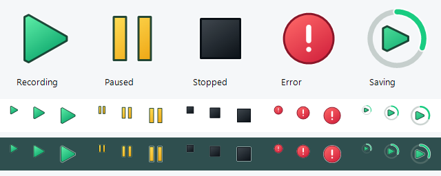
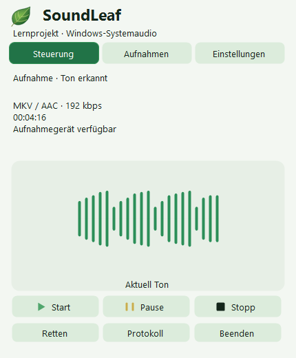

# SoundLeaf

[Benutzer-Setup und Deinstallation](SETUP.md). Der lokale Online-Installer bietet einen geprüften FFmpeg-9.0.1-Download. Setup startet keine Aufnahme; der spätere App-Start nimmt nach Prüfungen auf. Noch kein veröffentlichter Download.

Deutsch · [Русский](README.ru.md) · [English](../README.md)

**Reines Lernprojekt · Windows 11 · x64 · Vorabversion 3.0.4**

SoundLeaf ist ein C#-Lernprojekt zu Windows-Systemaudio, Hintergrundverarbeitung, sicherer Dateispeicherung und Bedienung im Infobereich. Es ist keine professionelle Aufnahmelösung. Oberfläche und Dokumentation sind deutsch, russisch und englisch; die Sprache ändert sich sofort.

Die Aufnahme startet automatisch beim Öffnen der EXE. Das Symbolmenü bietet Start, Pause/Fortsetzen, Stoppen und Speichern, Ergebnis, Öffnen der geprüften Datei, Wiederherstellung unvollständiger Sitzungen und Autostart für den aktuellen Benutzer ohne Administratorrechte.

- Grünes Dreieck: Aufnahme. Gelbe Balken: Pause. Schwarzes Quadrat: gestoppt.
- Dickerer drehender Bogen um ein festes grünes Dreieck genau in der Mitte: Verarbeitung, keine Prozentanzeige. 24 vorbereitete Bilder, jeweils 80 ms.
- Rot: Fehler oder frühere unvollständige Sitzungen im gestoppten Zustand.

Die Quelle ist das standardmäßige Windows-Ausgabegerät, nicht das Mikrofon. Stille ist kein Fehler. Nur erlaubte Inhalte aufnehmen und erforderliche Zustimmung einholen.

Vor Aufnahmebeginn prüft ein Hintergrund-Thread Schreiben, Datenträger-Flush und Umbenennen einer eigenen Testdatei sowie kurzes Kodieren des gewählten Profils und Dekodieren mit jeweils drei Sekunden Prozesslimit. Unter 256 MiB freiem Speicher wird die Aufnahme gesperrt; zwischen 256 MiB und 1 GiB wird gewarnt. Nicht messbarer Speicher erlaubt den Start nur nach erfolgreicher Ordnerprüfung mit Warnung. Die Anfangsprüfung garantiert keinen Platz für die gesamte Aufnahme.

## Speicherung und Wiederherstellung

Zunächst wird eine WAV-Sicherung mit regelmäßiger Aktualisierung und Datenträger-Flush geschrieben. Parallel entsteht AAC mit 192 kbit/s. Interne Teile werden nach dem Stoppen zu einer MKV zusammengeführt; vor dem Entfernen der WAV-Sicherung werden Dekodierung und Dauer geprüft. Die Oberfläche zeigt Verarbeitungsschritte und den geprüften Ausgabepfad. Frühere offene Sitzungen werden separat gezählt.

Bei fehlgeschlagener FFmpeg-Prüfung startet keine automatische Aufnahme. Der Menüpunkt „Начать запись только в WAV“ bietet ausdrücklich WAV ohne Encoder an. Menü und Tooltip kennzeichnen diesen Modus. Nach dem Stoppen werden geprüfte Pfade und der Ordnerbefehl angezeigt: WAV gespeichert, keine MKV erstellt. Lange Aufnahmen bleiben Teile bis 256 MiB, keine unbegrenzt große WAV. Ein atomarer Abschlussvermerk in `State/Sessions` verhindert die Einstufung abgeschlossener WAV-Sitzungen als Absturz. Bei Vermerkfehler bleibt Audio erhalten und der Status meldet einen Fehler. `State` beim Umzug mitnehmen.

Die Wiederherstellung nutzt vollständige und unvollständige WAV-Teile derselben Sitzung. Fehlende/mehrdeutige Teile, aktive Schreiber, unterschiedliche Formate und vorhandene Zieldateien werden abgelehnt. Nach erfolgreicher Prüfung werden Originale nach `Backups/RecoveredSessions` verschoben; die automatische 24-Stunden-Bereinigung betrifft diesen Ordner nicht. Bei Fehlern bleiben Originale erhalten, Arbeitsdateien können in `RecoveryWork` verbleiben.

## Profile, Panel und Aufnahmen

Das Panel öffnet sich in 280 ms vom tatsächlichen Tray-Symbol aus und schließt sich in 220 ms. Bei deaktivierten Windows-Animationen sind beide Vorgänge sofortig. Eine geglättete, zwischengespeicherte Bildfläche bewegt sich ohne Größenänderungen des echten Fensters oder erneutes Layout pro Bild. Die übliche Größe ist 430 × 520 logische Pixel. Es bleibt innerhalb der Monitor-Arbeitsfläche und berücksichtigt Per-Monitor-DPI. Bei fehlenden Symbolkoordinaten dient der gespeicherte Klickpunkt als Ersatz. Erneuter Klick, Escape und Fokusverlust verbergen nur das Panel, nicht die Aufnahme.

Über Start/Pause/Stopp zeigt ein zentriertes Histogramm aus 21 getrennten abgerundeten Säulen echte PCM-Pegel mit 95% visueller Ausprägung. Die laufende Aufnahme hat fünf kompakte Balken; ihre Ruhelinie ist nur 31 logische Pixel breit. Beide Anzeigen besitzen eigene zeitbasierte Glättung; neue Daten lassen die sichtbaren Höhen nicht springen. Stille blendet kurz und weich zur ruhenden Linie über; Pause/Stopp beenden die Bewegung sofort. Daten kommen alle 50 ms und verfallen nach 150 ms; die restliche Darstellung klingt kurz ab (bis 200 ms modellierte Hüllkurvenzeit, keine Windows-Zeitgarantie). Es sind Pegelanzeigen, keine Wellenform oder Frequenzspektren. Die Darstellungsgrenze entfernt keinen aufgenommenen Ton. „Ton erkannt“ bleibt während Sprechpausen bestätigt; Geräteverfügbarkeit beweist keine bestimmte hörbare Anwendung. Aufnahme, PCM, Codecs, Tray-Zustände und natürliches Blatt bleiben unverändert.

Keine Seiten-Scrollleisten: Unter 450 logischen Pixeln Höhe gliedern sich Einstellungen in Audio / Dateien / Design. Ordnerpfad und Codec-Details stehen vollständig im Tooltip. Aufnahmen werden seitenweise angezeigt. Abgerundete Auswahlfelder unterstützen Tab, Pfeile, Enter, Leertaste und Escape; Escape schließt zuerst die Liste, dann das Panel. Formatnamen werden kleingeschrieben; Audioeinstellungen bleiben unverändert.

Standard bleibt **MKV / AAC 192 kbit/s**, mit ursprünglicher Abtastrate und Kanalzahl. Einstellungen wählen ein Ausgabeformat: MKV/AAC, OGG/Opus (anfangs 24 kbit/s, mono), MP3, M4A/AAC oder AAC/ADTS. Opus nutzt 48 kHz, Sprachprofil und VBR-Zielbitrate, keine feste Dateigröße. MP3 nutzt CBR. Weitere AAC/MP3-Profile nutzen 48 kHz, behalten mono/stereo und mischen Mehrkanalton zu stereo. WAV sichert unverändertes PCM.

Opus: 16/24/32/48/64/96/128; AAC und MP3: 64/96/128/160/192/256/320 kbit/s. Bitraten werden pro Format gespeichert. Format und Speicherordner ändern sich nur im gestoppten Zustand; das Sitzungsprofil bleibt unveränderlich. Sprache Deutsch / Русский / English und helles/dunkles/systemabhängiges Design wechseln sofort, auch während einer Aufnahme.

Linksklick öffnet das kompakte Laub-Panel mit Steuerung, Aufnahmen und Einstellungen; Rechtsklick das Ersatzmenü. Escape oder ein Klick außerhalb blendet es aus, ohne die Aufnahme zu stoppen. Kein Hauptfenster und keine Taskleisten-Schaltfläche.

Der Speicherordner ist wählbar. Vorhandene Dateien werden nicht verschoben; vorher gewählte Ordner bleiben in der Bibliothek. Standard bleibt `Recordings` neben der EXE. Eigene Ziele enthalten auch `State/Sessions`, Sicherungen und Wiederherstellungsdateien; Metadaten mitnehmen. Programmeinstellungen bleiben neben der EXE.

Aufnahmen laden im Hintergrund, neueste zuerst, mit Format, Größe und bekannter Dauer. Abgeschlossene WAV-Teile sind gruppiert; temporäre Dateien ausgeschlossen. Alte Dateien ohne gültige Metadaten gelten als vorhanden, nicht geprüft; unbekannte Dauer wird nicht erfunden. Keine Massendekodierung beim Öffnen. Öffnen, im Ordner zeigen und in anderem Format speichern sind möglich; Löschen und Momentmarken fehlen bewusst.

Konvertieren erzeugt eine neue geprüfte Datei mit gewähltem Format, Bitrate und Ziel; das Original bleibt unverändert. Erneutes Kodieren erhöht die Qualität nicht. Bestehende Ziele und falsche Dateiendungen werden abgelehnt; WAV-Teile werden als ein PCM-Strom gelesen.

Zusatzformate verwenden einen Encoder über WAV-Grenzen hinweg und eine begrenzte Warteschlange. Fehler führen zur Neuerstellung aus geprüftem WAV-PCM. Vollständige Dekodierung, maximal 250 ms Dauerabweichung, Flush und Umbenennen ohne Überschreiben erfolgen vor WAV-Löschung. Sitzungsprofile werden vor Aufnahmebeginn atomar festgehalten; alte Sitzungen ohne Profil bleiben MKV/AAC 192.

## Build und Prüfungen

GitHub-Veröffentlichung steht noch aus. Die lokale Vorbereitung erstellt Quelltext- und portable x64-ZIPs mit SHA-256; FFmpeg ist ausdrücklich nicht enthalten. Das portable ZIP vollständig entpacken und dessen README lesen. Für Quelltext-Builds erzeugt `Build-Launcher.ps1` unter Windows PowerShell 5.1 die `SoundLeaf.next.exe`. Für MKV muss ein kompatibles `tools/ffmpeg.exe` neben der EXE liegen; ausdrücklich gewähltes WAV benötigt keinen Encoder. Einen beschreibbaren Ordner verwenden; beim Umzug den gesamten Ordner mitnehmen und Autostart neu aktivieren.

`Run-Checks.ps1` führt Build, synthetische Tests, Symbolprüfungen und echte MKV-/WAV-Loopback-Tests aus. Die letzten Tests zeichnen Systemaudio im separaten Ordner `Verification` auf. Für SoundLeaf-Builds sind Python und ein separates SDK nicht erforderlich.

Praktisch nur auf einem Windows-Rechner geprüft. Der Besitzer bestätigt normalen Ton der letzten Aufnahme und funktionierende lange Sitzungen; dies ist kein eigenständiger instrumentierter Lasttest. Stromausfall und voller echter Datenträger wurden nicht getestet. Keine absolute Datensicherheitsgarantie. Bei Wechsel/Trennung des Ausgabegeräts eine neue Sitzung beginnen. Private Aufnahmen und persönliche Pfade nicht öffentlich teilen.

## Bilder und Release

Testpanel mit Beispielsitzungen und synthetischen Pegeln, keine echten Gespräche. [Release-Vorbereitung](RELEASE.md). `Prepare-Release.ps1` verlangt vollständige MegaProg-Prüfung, passenden Commit/EXE-Hash und sauberen Git-Stand. Nur lokale Archive/Prüfsummen; keine Veröffentlichung, Tags oder automatische Aufnahme. Der Windows-Workflow prüft nur Quelltext/Build/Symbole, nicht echte Aufnahme. Rechte bleiben unverändert.

[Anleitung](Guide-de.html) · [Architektur](ARCHITECTURE.md) · [Prüfungen](VERIFICATION.md) · [Änderungen](../CHANGELOG.md) · [Rechte](../RIGHTS.md) · [Drittanbieter](../THIRD_PARTY_NOTICES.md)
