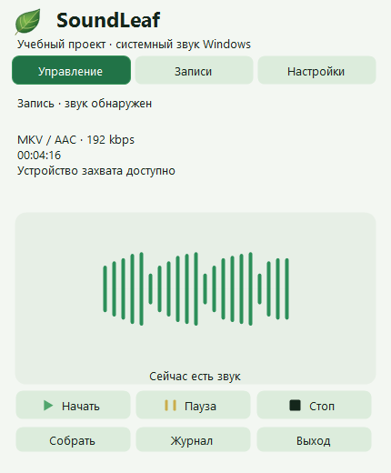
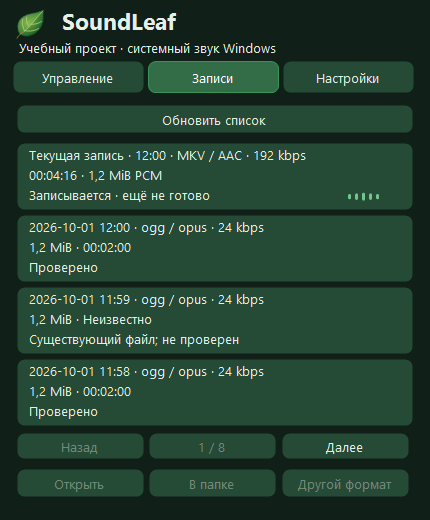

# SoundLeaf

[Установка без администратора и удаление](SETUP.md). Локальный online-установщик предлагает проверяемую загрузку FFmpeg 9.0.1. Он сам не запускает запись; последующий запуск SoundLeaf начинает её после проверок. Выпуск пока не опубликован.

[Deutsch](README.de.md) · [English](../README.md) · Русский

**Сугубо учебный проект · Windows 11 · x64 · Предварительная версия 3.0.5**

SoundLeaf — учебный проект на C# для изучения работы с системным звуком Windows, фоновой обработки, безопасного сохранения файлов и интерфейса в трее. Не является профессиональным средством записи.

## Управление

Панель сразу появляется над настоящим значком трея и сразу скрывается. Анимация с подменой окна изображением убрана: она вызывала рывки и позднее появление тени. Обычный размер — 430 × 520 логических пикселей, положение ограничено рабочей областью монитора, DPI учитывается отдельно для каждого монитора. Если прямоугольник значка недоступен, используется сохранённая точка щелчка. Повторный щелчок, Escape и потеря фокуса скрывают панель, не останавливая запись.

Над кнопками начала, паузы и остановки — гистограмма из 21 раздельного округлого столбика реального уровня PCM, с выразительностью 95%. В карточке текущей записи — пять компактных столбиков; линия тишины занимает только 31 логический пиксель. У каждого индикатора своё сглаживание по времени, новые данные не скачком меняют высоту. При тишине столбики коротко и плавно переходят в неподвижную линию; пауза и остановка сразу прекращают движение. Данные приходят каждые 50 мс, устаревают через 150 мс; остаточный рисунок коротко затухает (до 200 мс в модели сглаживания, без гарантии времени работы Windows). Это индикаторы уровня, не осциллограмма или спектр. Текущая индикация включается примерно при −48 dBFS RMS и выключается ниже −54 dBFS: слабый шум и отдельные пики не включают её. Очень тихий реальный звук может отображаться как тишина. Порог не вырезает звук из записи. «Звук обнаружен» сохраняет подтверждение ранее полученного сигнала во время перерыва; доступность устройства не гарантирует слышимость конкретного приложения. Захват, PCM, кодеки, значки состояний и натуральный лист не меняются.

Прокрутки страниц нет. При высоте меньше 450 логических пикселей настройки разделены на «Запись / Файлы / Оформление». Полный путь папки и параметры кодеков доступны в подсказках; записи перелистываются страницами. Скруглённые поля выбора поддерживают Tab, стрелки, Enter, Space и Escape: первый Escape закрывает список, следующий — панель. Названия форматов в выборе строчные; параметры записи не изменились.

Запись начинается автоматически при запуске EXE. Левый щелчок открывает компактную панель «Управление / Записи / Настройки»; правый — резервное меню: начать новую запись, пауза/продолжение, остановить и сохранить, результат, открыть итоговый файл, собрать незавершённые записи, автозапуск и выход. Автозапуск относится к текущему пользователю и не требует прав администратора.

- Зелёный треугольник — запись.
- Две жёлтые полоски — пауза; время паузы исключается из файла.
- Более толстая вращающаяся дуга вокруг неподвижного зелёного треугольника по центру — сохранение или восстановление, не процент готовности. Анимация: 24 кадра, каждые 80 мс.
- Чёрный квадрат — остановлено.
- Красный знак — ошибка либо оставшиеся незавершённые сессии при остановленной записи.

Источник — устройство вывода Windows по умолчанию. Записывается его системный звук, не микрофон. Тишина сохраняет свою длительность и не считается ошибкой. Записывайте только разрешённые материалы с необходимым согласием участников.

Перед началом рабочий поток проверяет создание, запись, сброс на диск и переименование собственного временного файла, а также короткое кодирование выбранного профиля и декодирование с ограничением 3 секунды на процесс FFmpeg. Трей остаётся доступным. При свободном месте меньше 256 МиБ запись запрещена; от 256 МиБ до 1 ГиБ — предупреждение. Если место определить нельзя, запуск разрешён с предупреждением только после успешной проверки папки. Это не гарантия места на всю запись.

## Что означает «готово»

Во время сохранения показываются этапы кодирования, объединения и проверки. Итоговый путь передаётся интерфейсу только после проверки файла. Пункт «Открыть последний итоговый файл» относится к последнему проверенному результату текущей сессии. Успех новой сессии не означает, что старые незавершённые записи тоже собраны: их число показано отдельно.

Сначала звук сохраняется в WAV с периодическим обновлением заголовка и сбросом данных на диск. Параллельно кодируется AAC 192 кбит/с. Длинные записи разделяются внутри программы на части до 256 МиБ; после остановки получается один MKV. Перед удалением резервного WAV результат декодируется и проверяется по длительности. При сбое кодировщика используется резервный WAV. При ошибке исходники сохраняются.

Если предварительная проверка FFmpeg не пройдена, запись автоматически не начинается. Причина показана в результате; выберите «Начать запись только в WAV» явно. В этом режиме кодировщик не запускается, в меню и подсказке написано «только WAV». После остановки результат сообщает «WAV сохранён; MKV не создавался», перечисляет проверенные файлы и предлагает открыть их папку. Длинная запись остаётся набором частей до 256 МиБ, а не одним WAV неограниченного размера.

Успешное завершение WAV-режима атомарно отмечается в `State/Sessions` идентификатором, режимом и относительными путями проверенных частей. Такие записи не предлагаются для аварийного восстановления. Если фиксация не удалась, аудио остаётся, но программа показывает ошибку. При переносе приложения сохраняйте `State` вместе с `Recordings`.

## Форматы, панель и список записей

Основной профиль остаётся **MKV / AAC 192 кбит/с**, с исходными каналами и частотой. В настройках можно выбрать один формат: MKV/AAC, OGG/Opus (по умолчанию 24 кбит/с, моно), MP3, M4A/AAC или AAC/ADTS. Opus: 48 кГц, VBR с профилем речи; битрейт целевой, размер не гарантируется. MP3: постоянный битрейт. Дополнительные AAC/MP3: 48 кГц, моно/стерео; многоканальный источник сводится в стерео. Резервный WAV сохраняет исходный PCM.

Opus: 16/24/32/48/64/96/128; AAC и MP3: 64/96/128/160/192/256/320 кбит/с. Битрейт каждого формата запоминается. Формат и папка меняются только после остановки; текущая сессия хранит неизменяемый профиль. Deutsch / Русский / English и светлая/тёмная/системная тема переключаются сразу, без остановки записи.

Левый щелчок открывает листьевую панель «Управление / Записи / Настройки», правый — резервное меню. Escape и щелчок снаружи скрывают панель, но не останавливают запись. Главного окна и кнопки на панели задач нет.

В настройках выбирается папка сохранения. Старые файлы не перемещаются; прежние выбранные папки остаются в списке записей. По умолчанию используется прежняя `Recordings` рядом с EXE. В выбранной внешней папке также размещаются её `State/Sessions`, резервные копии и рабочие файлы восстановления; переносите метаданные вместе с аудио. Настройки приложения остаются рядом с EXE.

Список загружается в фоне, новые записи сверху; показывает формат, размер и известную длительность. Завершённые WAV-части группируются. Временные файлы не выдаются за готовые; старые без метаданных отмечаются как существующие, но непроверенные, без выдуманной длительности. Открытие списка не запускает массовое декодирование. Можно открыть файл, показать папку или пересохранить; удаления и отметок моментов нет.

«Пересохранить» создаёт отдельный проверенный файл с выбранными форматом, битрейтом и местом сохранения; исходник не меняется. Перекодирование сжатого звука не повышает качество. Существующий итог и неправильное расширение запрещены. WAV-части читаются одним непрерывным PCM-потоком.

Для дополнительных форматов один кодировщик работает через границы WAV-частей. Ограниченная очередь не блокирует захват; при отказе итог пересоздаётся из проверенного WAV. Полное декодирование, проверка длительности с допуском 250 мс, сброс на диск и переименование без перезаписи предшествуют удалению WAV. Профиль фиксируется до начала захвата; восстановление использует его, а для старых сессий без профиля — MKV/AAC 192.

## Аварийное восстановление

После остановки выберите «Собрать незавершённые записи». Программа группирует WAV по идентификатору сессии и номеру части, проверяет последовательность, формат и отсутствие активного писателя. Итоговый файл не перезаписывается. После успешной проверки исходные WAV и временные MKV переносятся в `Backups/RecoveredSessions`, где автоматическая очистка их не удаляет. При неудаче оригиналы не удаляются; рабочие файлы могут остаться в `RecoveryWork`.

При пропущенной или дублированной части, несовместимом формате либо уже существующем итоге требуется ручной разбор; автоматическое удаление и перезапись запрещены.

## Запуск, сборка и ограничения

Публикация на GitHub ещё не выполнена. Подготовка выпуска создаёт ZIP исходников и переносимый x64-пакет с SHA-256, явно без FFmpeg. Переносимый архив распакуйте целиком и следуйте его README. Для сборки из исходников создаётся `SoundLeaf.next.exe`; для MKV нужен совместимый `tools/ffmpeg.exe` рядом с EXE, для явно выбранного WAV-режима он не нужен. Запускайте из доступной для записи папки и переносите всю папку целиком. После переноса заново включите автозапуск. Записи находятся в `Recordings/ГГГГ-ММ-ДД`, журналы — в `logs`.

Для сборки используйте Windows PowerShell 5.1: `Build-Launcher.ps1`. Для полного прогона — `Run-Checks.ps1`. Живой тест действительно захватывает системный звук в отдельный каталог `Verification`; остальные тесты используют синтетические данные. Python и отдельный SDK для сборки SoundLeaf не нужны.

Проверено локально на одном Windows-компьютере. Владелец подтвердил нормальный звук последней записи и работу длинных сессий; это не отдельный инструментированный нагрузочный прогон. Отключение питания и заполнение реального диска не проверялись. Гарантии абсолютной сохранности нет. При смене/отключении устройства начните новую запись. Личные записи, журналы и пути не публикуйте без проверки.

## Снимки и выпуск

Это рендеры тестовой панели с демонстрационными сессиями и искусственным уровнем, не реальные разговоры. [План и тексты выпуска](RELEASE.md). `Prepare-Release.ps1` сверяет полный результат MegaProg, коммит и хеш EXE; создаёт только локальные архивы и контрольные суммы. GitHub workflow проверяет только сборку/исходники/значки, не всю запись. Отправки, тегов и автоматического запуска нет; права не меняются.

[Руководство](Guide-ru.html) · [Архитектура](ARCHITECTURE.md) · [Проверки](VERIFICATION.md) · [Изменения](../CHANGELOG.md) · [Права](../RIGHTS.md) · [Сторонние компоненты](../THIRD_PARTY_NOTICES.md)
